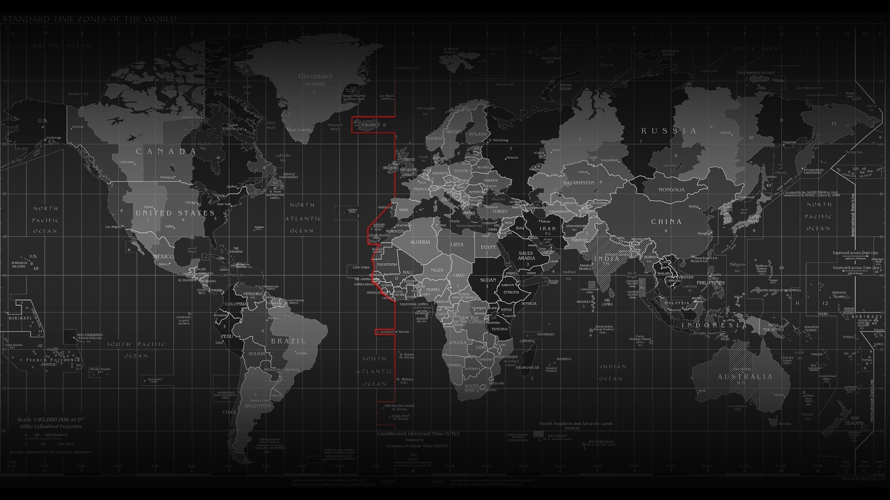

# STA 323 & 523 :: Homework 05

## Introduction

<i>Source</i>: https://wallpapercave.com/world-map-black-wallpaper-hd

Terrorism as defined by the Global Terrorism Database is:
> “The threatened or actual use of illegal force and violence by a non-state
actor to attain a political, economic, religious, or social goal through fear,
coercion, or intimidation.”

In this assignment you will work with data that contains the most comprehensive
unclassified recordings of terrorist attacks in the world. The data is curated
by the Global Terrorism Database (GTD) and is made available by the National
Consortium for the Study of Terrorism and Responses to Terrorism (START).

## R project organization

#### Directories, scripts, and Rmarkdown

Create the following directories inside your project.
- `data/`
- `R/`
- `figures/`

You should create the following R script files and put them in the
directory named `R/`:

- `get_gtd_99_08.R`: this script should fetch all the terrorist attack data at
  the available links for the years 1999 - 2008. The resulting data object
  should be saved in `data/` with a meaningful name.

- `get_gtd_09_18.R`: this script should fetch all the terrorist attack data at
  the available links for the years 2009 - 2018. The resulting data object
  should be saved in `data/` with a meaningful name.

- `parse_gtd.R`: this script should read in the data objects saved from both
  R scripts above and construct an appropriate data frame or other list
  object you will be able to use in Task 4. It should output a file named
  `gtd.rds` that will live in `data/`.

- `visualize_gtd.R`: this script should read in `gtd.rds` and create your
  visualizations for Task 4. It should also save those visualizations to
  `figures/`.

The main file, `hw_05.Rmd`, should contain your documentation, explanations,
and visualizations. There won't be much code in `hw_05.Rmd`. Any code
you think you need should be not be shown by setting the chunk option
`echo = FALSE`. This will still display the code's output.

#### make

Create a `Makefile` that connects all of the project's prerequisites with the
final target goal being `hw_05.html`. Your `Makefile` should be set-up such that
if there are no data files, `make` will execute the recipes to run the necessary
scripts in order to produce `hw_05.html`. Include phony targets `clean_data` and
`clean_html` with recipes that will remove the `data/` directory and all its
contents, and `hw_05.html`, respectively. You must incorporate at least two
built-in variables in your `Makefile`.

A starter `Makefile` has been provided.

## Tasks

#### Task 1

**Scrape GTD: 1999 - 2008** - `get_gtd_99_08.R`

Scrape the data on terrorist attacks from 1999 - 2008 (see Slack channel). You
should combine all the scraped data and create a single object (data frame,
tibble, or list). The resulting data object should be saved in `data/` with a
meaningful name.

Space out your requests when downloading the data. However, `make` must be
able to build your `hw_05.html` file in under 1 hour.

Include a detailed write-up of your scraping procedure in `hw_05.Rmd`.

#### Task 2

**Scrape GTD: 2009 - 2018** - `get_gtd_09_18.R`

Scrape the data on terrorist attacks from 2009 - 2018 (see Slack channel). You
should combine all the scraped data and create a single object (data frame,
tibble, or list). The resulting data object should be saved in `data/` with a
meaningful name.

Consult the GTD codebook under the About page of the GTD website for a complete
description of the variables and to understand the country codes that are
available.

Space out your requests when downloading the data. However, `make` must be
able to build your `hw_05.html` file in under 1 hour.

Include a detailed write-up of your scraping procedure in `hw_05.Rmd`.

#### Task 3

**Parse data** - `parse_gtd.R`

Combine, clean, and organize your scraped data. You only need to keep the data
you will use for your visualizations in Task 4. It is also okay to keep all the
variables. This script should output a file named `gtd.rds` that will live in
`data/`.

Consult the GTD codebook under the About page of the GTD website for a complete
description of the variables.

#### Task 4

**Visual analysis** - `visualize_gtd.R`

Create a visualization or small set of visualizations that is in the spirit of
what the GTD is designed for: "for the purpose of better understanding or
defeating terrorism". You should save your figures into `figures/`.

Load your visualizations into `hw_05.Rmd`. Include a detailed write-up of your
visualizations in `hw_05.Rmd` and touch on how your visualizations aid in a
better understanding or defeating terrorism. You may also include tables.

#### Task 5

Enhance or decorate your Rmd file. Incorporate some of the features I used in
labs this semester. Feel free to expand beyond these features. Check out Holtz's
[Pimp my RMD](https://holtzy.github.io/Pimp-my-rmd/) website. To earn points
for this task you must implement something beyond what is found in RStudio's
R Markdown Cheat Sheet and R Markdown Reference Guide.

## Essential details

### Deadline and submission

**The deadline to submit Homework 05 is Wednesday, March 24 at 11:59pm EST.**
Only your final commit and code in the main branch will be graded. However,
you should continue to use branches to efficiently work together as a team.

### Help

- Post your questions in the #hw5 channel on Slack. Explain your error / problem
  in as much detail as possible or give a reproducible example that generates
  the same error. Make use of the code snippet option available in Slack. You
  may also send a direct message to the instructor or TAs.

- Visit the instructor or TAs in Zoom office hours.

- The instructor and TAs will not answer any questions about this assignment
 	within six hours of the deadline.

### Academic integrity

  This is a team assignment. You may communicate with other teams in the
  course. As a reminder, any code you use directly or as inspiration must
  be cited.

  To uphold the Duke Community Standard:

    - I will not lie, cheat, or steal in my academic endeavors;
    - I will conduct myself honorably in all my endeavors; and
    - I will act if the Standard is compromised.

  Duke University is a community dedicated to scholarship, leadership, and
  service and to the principles of honesty, fairness, respect, and
  accountability. Citizens of this community commit to reflect upon and
  uphold these principles in all academic and non-academic endeavors, and
  to protect and promote a culture of integrity. Cheating on exams and
  quizzes, plagiarism on homework assignments and projects, lying about an
  illness or absence and other forms of academic dishonesty are a breach
  of trust with classmates and faculty, violate the Duke Community
  Standard, and will not be tolerated. Such incidences will result in a 0
  grade for all parties involved as well as being reported to the
  University Judicial Board. Additionally, there may be penalties to your
  final class grade. Please review Duke’s Standards of Conduct.

### Grading

| **Topic**                           | **Points** |
|-------------------------------------|-----------:|
| Task 1                              |          6 |
| Task 2                              |          8 |
| Task 3                              |          2 |
| Task 4                              |          6 |
| Task 5                              |          2 |
| Project organization and `Makefile` |          6 |
| **Total**                           |     **30** |

*A portion of the points for each task will be allocated to code style and
efficiency.*

*Documents that fail to knit after minimal intervention will receive a 0*.
